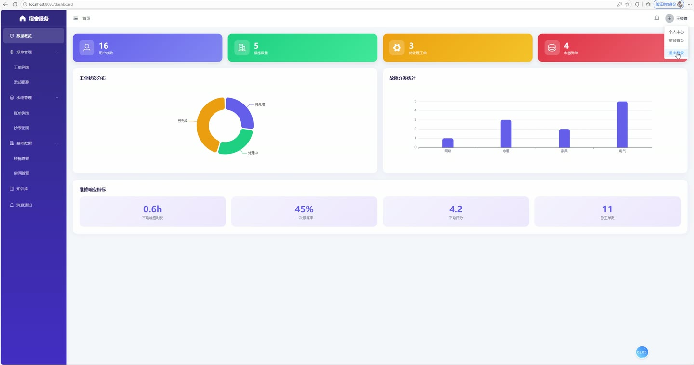
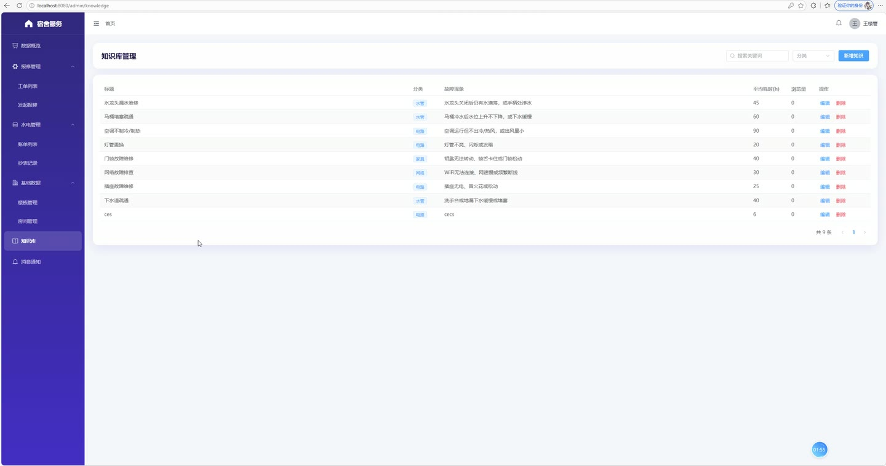
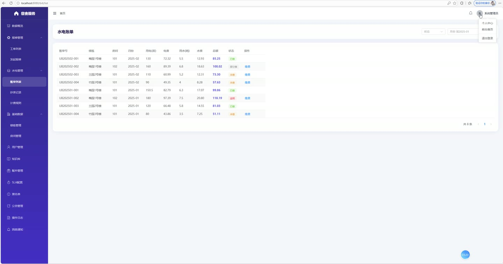
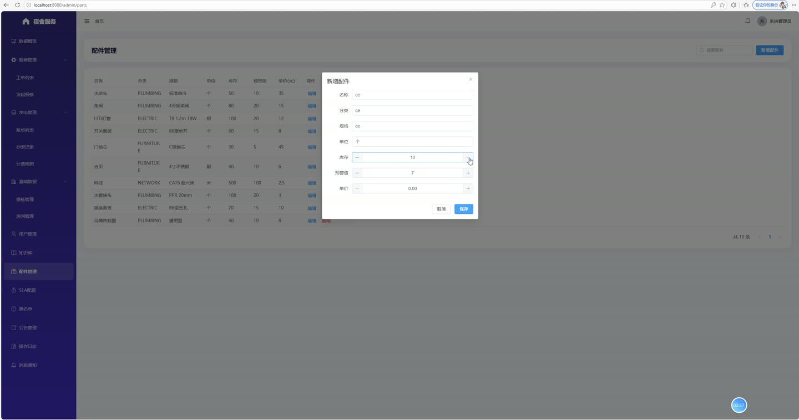
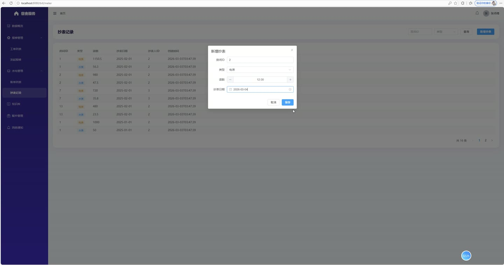
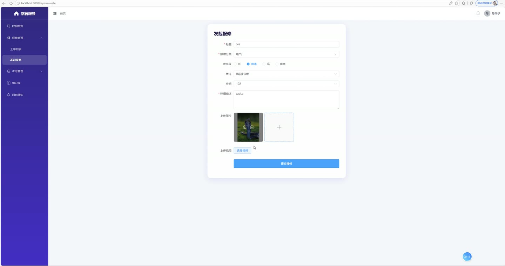

# (附文档)Springboot3+Vue3+MySQL 宿舍报修与水电缴费系统

**技术栈**：Springboot3、Vue3、MySQL

### 系统简介

本系统是一款基于 SpringBoot3 + Vue3 + MySQL 的宿舍报修与水电缴费一体化管理平台，采用前后端分离架构，内置 JWT 身份认证与 RBAC 权限控制。系统涵盖学生端、维修工端、管理员端三大角色，实现报修工单全流程跟踪、水电抄表计费、在线缴费、通知推送、知识库查询等核心业务，适用于高校或企业宿舍的数字化运营管理场景。
 
### 核心功能
 
### 普通用户端

- 用户注册与登录：支持新用户注册（默认分配学生角色），登录后获取 JWT Token，自动校验账号状态（禁用账号无法登录）。

- 个人资料管理：查看个人基本信息（用户名、姓名、手机号、邮箱、头像），支持修改个人资料（角色字段禁止修改）。

- 报修工单提交：填写报修标题、详细描述、故障分类、优先级（紧急/普通）、上传故障图片/视频，自动生成工单编号并记录提交人、所属楼栋与房间。

- 工单进度跟踪：查看个人报修工单列表，支持按状态（待派单/已派单/处理中/已完成/已评价）、分类、优先级筛选，实时查看工单当前处理节点。

- 工单评价：维修完成后对工单进行评分（1-5星）并填写评价内容，评价后工单状态变更为"已评价"。

- 水电账单查询：查看本人房间的水电账单列表，包含用电量、用水量、电费、水费、总金额、账单状态（未缴/已缴/逾期）、缴费截止日期。

- 在线缴费：对未缴账单发起支付，支持选择支付方式（模拟支付），支付成功后自动生成交易流水号并更新账单状态为"已缴"。

- 通知消息中心：接收系统推送通知（工单派单通知、工单完成通知），支持查看未读消息数量、标记单条已读、一键全部已读。

- 公告浏览：查看管理员发布的宿舍公告，支持按公告类型筛选，置顶公告优先展示。

- 知识库查询：浏览常见故障知识库（按分类筛选、关键词搜索），查看故障症状、解决方案、所需零件及预计维修时长。
 
### 维修工端

- 工单列表查看：查看分配给本人的工单列表，支持按状态、分类、优先级筛选，输入关键词可搜索工单标题或工单编号。

- 工单签到：到达维修现场后进行签到操作，上传签到照片、填写签到经纬度坐标，工单状态变更为"处理中"。

- 工单完成：维修完成后上传完工照片、填写维修备注、登记使用的备件信息，工单状态变更为"已完成"并自动通知学生进行评价。

- 备件库存查询：查看备件列表（备件名称、分类、规格、单位、库存数量、预警库存、单价），支持按名称关键词搜索。

- 知识库参考：查询故障知识库，获取常见故障的标准解决方案与所需备件清单。
 
### 管理员端

- 数据概览看板：查看系统核心统计数据，包括用户总数、楼栋总数、房间总数、报修工单统计（总数/待处理/处理中/已完成）、水电费统计（账单总数/未缴数量/应收总额/已收总额）。

- 用户管理：查看用户列表（支持按用户名/姓名/手机号搜索、按角色筛选），支持新增用户（默认密码 123456）、编辑用户信息、删除用户、禁用/启用账号。

- 楼栋管理：维护宿舍楼栋信息（楼栋名称、地址、楼层数、负责人、封面图、描述），自动统计每个楼栋的房间数量。

- 房间管理：维护房间信息（所属楼栋、房间号、楼层、容量、当前人数、电表编号、水表编号），支持按楼栋筛选。

- 报修工单派单：查看全部报修工单，将待派单工单指派给指定维修工（从在职维修工列表选择），派单后自动通知学生。

- 工单统计报表：查看工单分类统计（按故障分类统计数量）、平均响应时长（从提交到派单的平均小时数）、一次修复率、平均评分等运营指标。

- 水电抄表管理：录入房间水电表读数（选择房间、类型（电/水）、读数数值、抄表日期），自动关联抄表人。

- 计费规则配置：维护阶梯电价/水价规则（类型、阶梯名称、用量下限、用量上限、单价、生效日期、启用状态），支持多级阶梯计费。

- 账单管理：查看所有房间水电账单，支持按状态、账期月份、楼栋、房间筛选，手动创建或修改账单。

- SLA 服务等级配置：配置不同优先级工单的响应时限、解决时限、升级时限（按优先级和分类维护）。

- 公告管理：发布宿舍公告（标题、内容、封面图、类型、置顶标记），支持编辑、删除公告，置顶公告优先展示。

- 知识库管理：维护故障知识库条目（标题、分类、症状、解决方案、所需零件、平均维修时长），支持按分类筛选和关键词搜索。

- 备件库存管理：维护备件信息（名称、分类、规格、单位、库存数量、预警库存、单价），支持新增、编辑、删除备件。

- 黑名单管理：将违规房间加入黑名单（填写原因、类型），支持查看黑名单列表（显示楼栋和房间号）、解除黑名单。

- 操作审计日志：查看系统操作日志列表（操作人、用户名、操作内容、请求方法、参数、IP 地址、执行结果、耗时、时间），按时间倒序展示。

- 文件上传：支持上传图片等文件（单文件最大 50MB），自动按日期分目录存储并返回访问 URL。
 
### 技术栈

后端框架SpringBoot 3.x
ORM 框架MyBatis-Plus（含分页插件、逻辑删除）
权限认证Spring Security + JWT（自定义令牌生成与校验）
前端框架Vue 3（SPA 单页应用）
状态管理Vuex / Pinia（前端状态管理）
构建工具Vite（前端构建工具）
数据库MySQL 8.x（自动建库建表）
缓存中间件Redis（配置了 RedisTemplate 序列化）
文件存储本地磁盘上传（按日期分目录）
 
### 交付内容

- 后端完整源码

- 前端完整源码

- 数据库初始化脚本

- 万字文档

## 界面展示

---

## 获取完整源码 + 万字文档

本仓库为项目介绍页。**完整前后端源码、数据库初始化脚本、万字项目文档**，请加微信 `kangkangcode`，或访问 [codekk.top](http://codekk.top) 获取。

可作课程设计 / 毕业设计参考，支持远程部署调试。